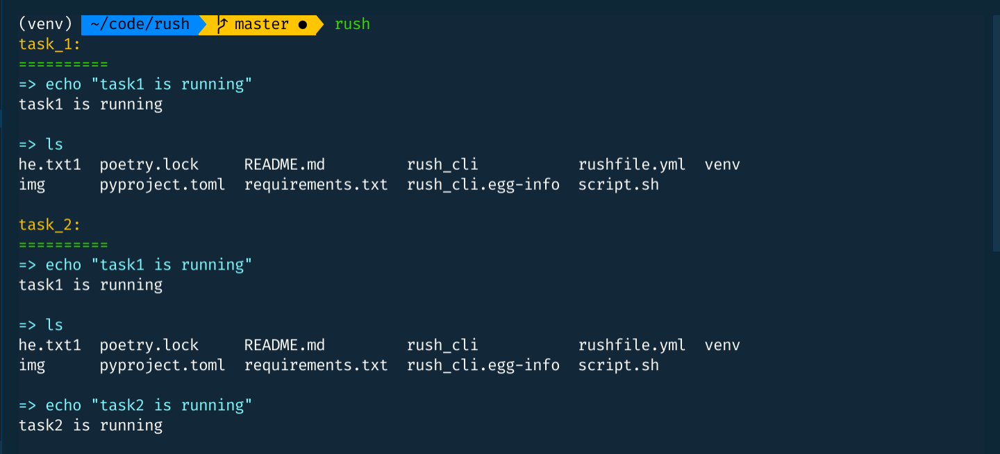

<div align="center">

# Rush 🏃
**A Minimalistic Shell Task Runner**


</div>

Run all your task automation **shell commands** from a single `rushfile.yml` file.

## Features
* Supports basic shell (not bash/zsh/fish syntax) commands for better portability
* By default, runs commands in interactive mode
* Highlights the commands as they get executed
* Option to catch or ignore command errors
* Option to show or supress command outputs
* Command chaining is supported (See the example `rushfile.yml` where `task_2` is chained to `task_1`)

## Installation

```
$ pip3 install rush-cli
```

## Workflow

* Here is an example `rushfile.yml`. It needs to reside in the root directory:

    ``` yml
    task_1: |
    echo "task1 is running"
    ls

    task_2: |
        task_1
        echo "task2 is running"

    task_3: |
        ls -a
        echo "task_3 subtask1 is running"

    task_4: |
        ls | grep "ce"
        ls > he.txt1

    task_0: |
        # an empty task
    ```

* See all the available options
    ```
    $ rush --help
    ```
    This should show:
    ```
    Usage: rush [OPTIONS] [FILTER_NAMES]...

    Options:
    --interactive / --not-interactive
                                    Option to show/hide interactive output.
    --color / --no-color            Option enable/disable colors.
    --print-cmd / --not-print-cmd   Option to enable/disable printing commands.
    --capture-err / --ignore-err    Option to capture/ignore errors.
    -h, --help                      Show this message and exit.
    ```

* Run all tasks
    ```
    $ rush
    ```

* Run specific tasks
    ```
    $ rush task_1 task_4
    ```
* Run tasks non interactively (supress the output)
    ```
    $ rush --not-interactive
    ```
* Run tasks without printing individual commands
    ```
    $ rush task_1 task_2 --not-print-cmd
    ```

* Run tasks ignoring errors
    ```
    $ rush --ignore-err
    ```

* Remove color
    ```
    $ rush --no-color
    ```


## Quirks

* Rush runs all the commands using `/bin/sh` (not bash or anything else). So shell specific scripts might throw error.
