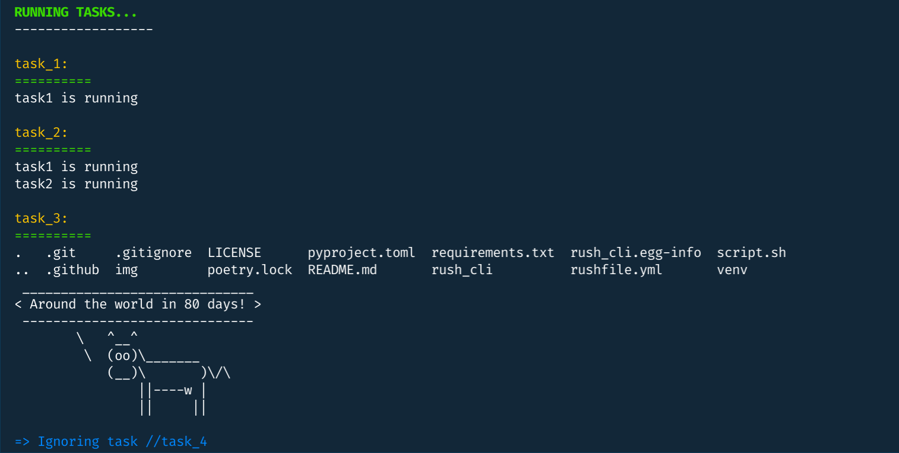
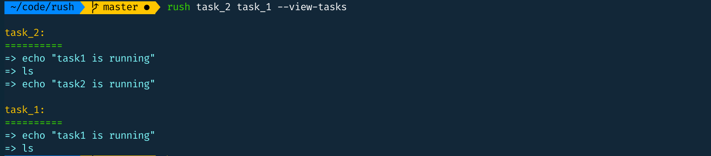

<div align="center">

# Rush 🏃
**♆ Rush: A Minimalistic Bash Utility**




**Run all your task automation **Bash commands** from a single `rushfile.yml` file.**
</div>


## Features
* Supports all **bash** commands
* Option to ignore or run specific tasks
* By default, runs commands in **interactive** mode
* Option to catch or ignore **command errors**
* Option to show or supress **command outputs**
* **Command chaining is supported** (See the example `rushfile.yml` where `task_2` is chained to `task_1`)

## Installation

```
$ pip3 install rush-cli
```

## Workflow

### Rushfile
Here is an example `rushfile.yml`. It needs to reside in the root directory:

``` yml
# rushfile.yml

task_1: |
    echo "task1 is running"

task_2: |
    # Task chaining [task_1 is a dependency of task_2]
    task_1
    echo "task2 is running"

task_3: |
    ls -a
    sudo apt-get install cowsay | head -n 0
    cowsay "Around the world in 80 days!"

//task_4: |
    # Ignoring a task [task_4 will be ignored while execution]
    ls | grep "ce"
    ls > he.txt1

task_5: |
    # Running a bash script from rush
    ./script.sh
```

### Available Options
To see all the available options, run:
```
$ rush
```
or,
```
$ rush --help
```
This should show:

```
Usage: rush [OPTIONS] [FILTER_NAMES]...

  ♆ Rush: A Minimalistic Bash Utility

Options:
  -a, --all          Run all tasks
  --hide-outputs     Option to hide interactive output
  --ignore-errors    Option to ignore errors
  -p, --path         Show the absolute path of rushfile.yml
  --no-deps          Do not run dependent tasks
  --view-tasks       View task commands
  -ls, --list-tasks  List task commands with dependencies
  --no-warns         Do not show warnings
  -v, --version      Show rush version
  -h, --help         Show this message and exit.
```

### Running Tasks

* **Run all the tasks**
    ```
    $ rush --all
    ```

* **Run specific tasks**
    ```
    $ rush task_1 task_4
    ```
* **Ignore specific tasks**

    See the example `rushfile.yml` where the `'//'` before a task name means that the task will be ignored during execution

    ```
    # rushfile.yml

    //task_4: |
        echo "This task will be ignored during execution."
    ```
    This ignores the task named `//task_4`.

* **Run tasks non interactively** (supress the outputs)
    ```
    $ rush --hide-outputs
    ```

* **Run tasks ignoring errors**
    ```
    $ rush --ignore-errors
    ```

* **Do not run the dependent tasks**
    ```
    $ rush task_2 --no-deps
    ```

### Viewing Tasks

* **View absolute path of rushfile.yml**
    ```
    $ rush --path
    ```
    output,
    ```
    /home/rednafi/code/rush/rushfile.yml
    ```

* **View task commands**
    ```
    $ rush task_5 task_6 task_7 --view-tasks
    ```
    

* **View task list with dependencies**
    ```
    $ rush -ls
    ```

## Quirks

* Rush runs all the commands using `/usr/bin/bash`. So shell specific syntax with other shebangs might throw error.

* If you are running Bash script from rush, use shebang (`#!/usr/bin/env bash`)
